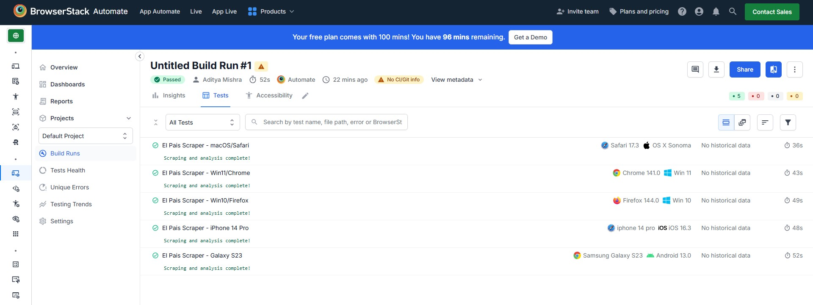
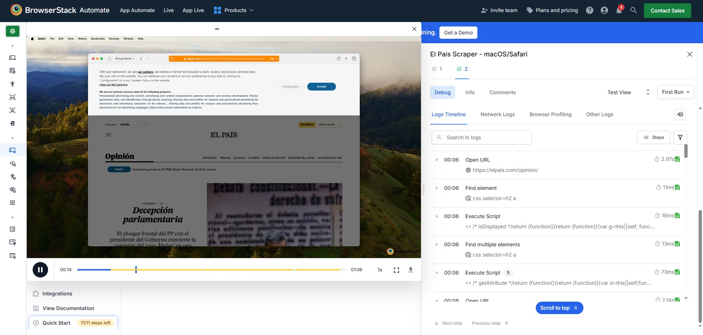

# El País Scraper & BrowserStack Automation

This project is a comprehensive demonstration of skills in web scraping, API integration, text processing, and cloud-based parallel testing.

The script automates a full workflow:

1.  **Web Scraping:** Uses Selenium to navigate to the El País (Spanish) opinion section and scrape the first 5 articles.
2.  **Data Extraction:** Gathers the full title, article content, and cover image (for the local test) for each article.
3.  **API Integration:** Feeds the Spanish titles into the `googletrans` API to get English translations.
4.  **Text Processing:** Analyzes the translated English titles to identify and count frequently repeated words.
5.  **Parallel Cloud Testing:** Executes the _entire_ workflow simultaneously across 5 different desktop and mobile browser configurations using BrowserStack.

---

## 📊 Final Result: BrowserStack Dashboard

The `browserstack_test.py` script executes all 5 test environments in parallel. The Automate Dashboard provides a full video recording, text logs, and pass/fail status for each test.





## 📊 Public Results URL

View the complete test results, including videos and logs, at:

[BrowserStack Public Results](https://automate.browserstack.com/projects/Default+Project/builds/Untitled+Build+Run/1?public_token=9c9d094787bf1f7eaaee36484489bfc7be3e0ab14ca9680e0eac1cfefdfa8844)

---

## 💻 Technologies Used

- **Python 3**
- **Selenium:** For browser automation and scraping.
- **BrowserStack:** For parallel cross-browser cloud testing.
- **googletrans:** For API-based translation.
- **Requests:** For downloading images.
- **Collections & re:** For text processing and analysis.
- **Threading:** For parallel execution.

---

## 🛠️ Setup & Installation

Follow these steps to get the project running.

### 1. Clone the Repository

```bash
git clone https://github.com/Ciriously/BrowserStack_Automation_Demo
cd BrowserStack_Automation_Demo
```

### 2. Set Up Credentials

This project uses a `.env` file for secure credential management.

- This project uses a `.env` file for secure credential management.

- Create a new file named .env in the root of the project.

Add your BrowserStack credentials to this file:

```bash

BS_USER="YOUR_USERNAME_HERE"
BS_KEY="YOUR_ACCESS_KEY_HERE"
```

The included `.gitignore` file will prevent this file from ever being committed.

### 3. Install Dependencies

It is highly recommended to use a Python virtual environment.

```bash
# Create a virtual environment
python -m venv venv

# Activate the virtual environment
# On Mac/Linux:
source venv/bin/activate
# On Windows:
.\venv\Scripts\activate

# Install all required libraries
pip install -r requirements.txt
```

### 3. ▶️ How to Run

There are two scripts to run:

##### 1. `local_test.py`

This script runs the entire process on your local machine using your local Chrome browser. It's perfect for quickly debugging the scraping logic.

```bash
python local_test.py
```

##### 2. `browserstack_test.py` (Main Script)

This is the final product. It runs the full 5-thread parallel test build on the BrowserStack cloud, loading its credentials from your `.env` file.

```bash
python browserstack_test.py
```

After running, log in to your BrowserStack Automate dashboard to see the live results.
